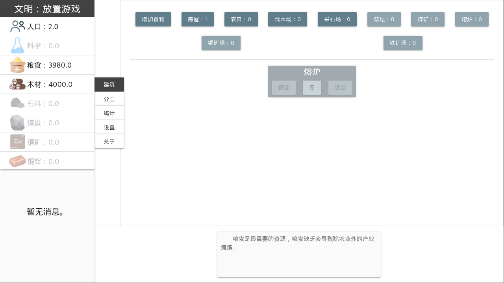
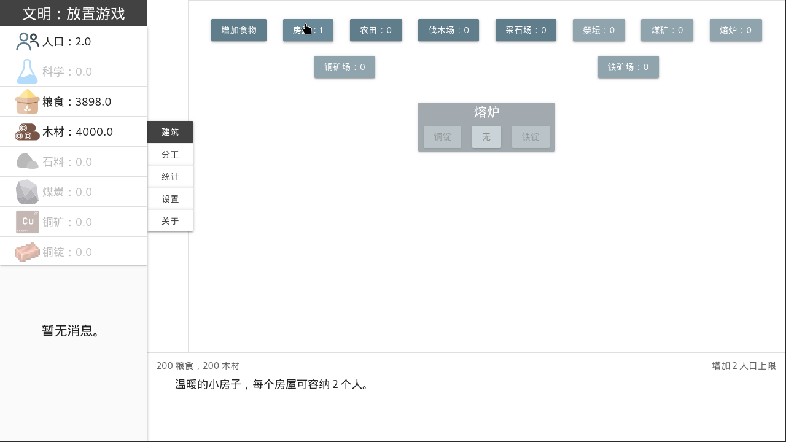
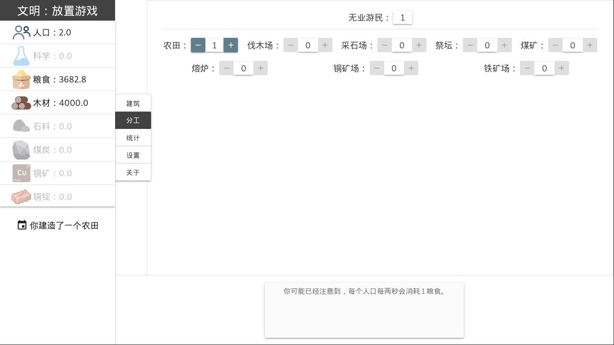

# 文明：放置游戏 Civilization-IdleGame

学习 [Vue.js](https://vue3js.cn/) 时写的小游戏，灵感主要来自另一款游戏，[猫国建设者](https://www.bloodrizer.ru/games/kittens/)。

尚未开发完成。

* * *

# 屏幕截图







* * *

# 使用方法

本项目已 commit 构建后的代码，你可以在下载源码后直接在浏览器中打开 `dist/` 中的 `index.html` 使用。

若需要自行修改及构建，请查看下面命令

安装依赖
```
npm install
```

启用 `vue-cli-service` (在浏览器中输入 http://localhost:8080 打开):
```
npm run serve
```

构建项目:
```
npm run build
```
* * *

# 框架与库

[Vue.js](https://vue3js.cn/): 一个渐进式 JavaScript 框架

[Materiallize](http://www.materializecss.cn): 一个 Material Design 风格的 UI 库

[Perfect Crollbar](https://github.com/mdbootstrap/perfect-scrollbar): 一个 `MDBootstrap` 的滚动条组件